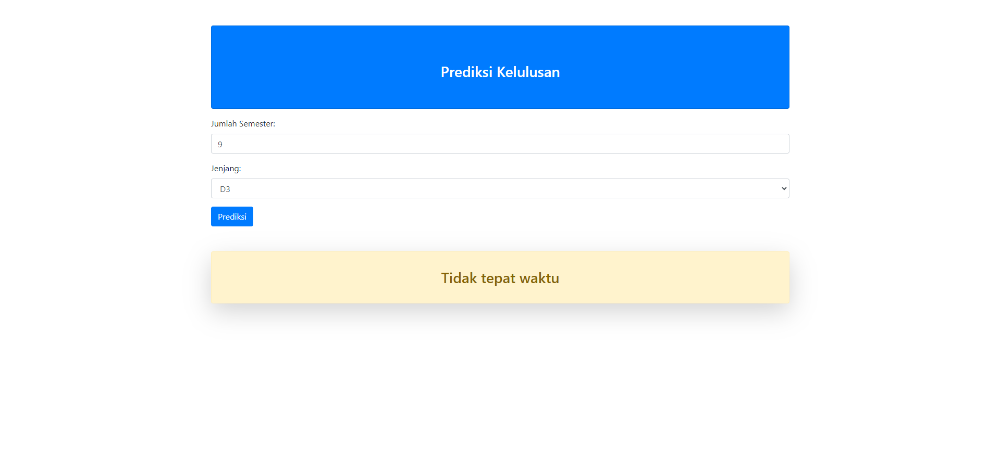

# 👩‍🎓PREDIKSI KELULUSAN MAHASISWA 🧑‍🎓

Aplikasi ini bertujuan untuk memprediksi apakah seorang mahasiswa akan lulus tepat waktu atau tidak berdasarkan data kelulusan mahasiswa. Pengembangan aplikasi ini menggunakan Metode Logistik Regresi dalam Machine Learning (ML). Data yang digunakan untuk pembangunan aplikasi diperoleh dari data kelulusan mahasiswa.

## ⚙️ Cara Menggunakan ⚙️

### 👉 Menggunakan Docker

1. Buka directory aplikasi ini di terminal.
2. Jalankan perintah berikut:
   ```bash
   ./auto/start
   ```
   > Pertama kali menjalankan aplikasi ini memerlukan beberapa saat untuk membuild imagenya.
3. Buka browser dan akses `localhost:5000`

### 👉 Menggunakan Local Python

1. Buka directory aplikasi ini di terminal.
2. Install dependensi dengan menjalankan perintah:
   ```bash
   pip install -r requirements.txt
   ```
   > Diperlukan hanya saat pertama kali menjalankan aplikasi.
3. Jalankan aplikasi dengan perintah:
   ```bash
   python app/main.py
   ```
4. Buka browser dan akses `localhost:5000`


## 📸 Screenshot 📸


